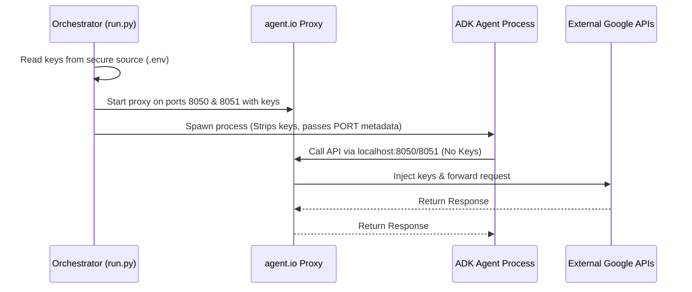

# Agent.io Secure Integration Skill

This skill outlines how to route Google Agent Development Kit (ADK) agents through the `agent.io` local proxy securely by separating **Topology Configuration** from **Secrets**.

By splitting the configuration, we keep API keys completely hidden from the agent process, while allowing the agent to dynamically discover proxy ports from checked-in config files.

---

## 🔒 Security Architecture

To prevent LLM-generated code or compromised tools from leaking your `GOOGLE_MAPS_API_KEY` or `GEMINI_API_KEY`, we enforce a strict security boundary:



---

## 📄 Split-Configuration Pattern (Sample Files)

To enable automatic config discovery without exposing secrets, split your HCL configuration files into a public topology file (checked into Git) and a private secrets file (gitignored).

### 1. `io.hcl` (Public - Checked into Repository)
This file defines only the routing topology and port mappings. It contains **no** secret values and is safe for the agent process to read:

```hcl
# io.hcl
calling "google-maps-mcp" {
  target = "mapstools.googleapis.com"
  port   = 8050
  apply_header "X-Goog-Api-Key" {
    secret = "google-maps-api-key"
  }
}

calling "gemini-api" {
  target = "generativelanguage.googleapis.com"
  port   = 8051
  apply_header "x-goog-api-key" {
    secret = "gemini-api-key"
  }
}
```

### 2. `secrets.hcl` (Private - Gitignored)
This file contains the actual secret keys. It is loaded by `agent.io` but is **never** accessible to the agent process:

```hcl
# secrets.hcl
secret "google-maps-api-key" {
  value = "<YOUR_GOOGLE_MAPS_API_KEY>"
}

secret "gemini-api-key" {
  value = "<YOUR_GEMINI_API_KEY>"
}
```

---

## 🐍 Python Implementation Steps

To use the shared assets in any Python sample agent, first add the skill resources folder to your Python path dynamically:

```python
import sys
import pathlib

def _find_workspace_root(start_path: pathlib.Path) -> pathlib.Path:
    for parent in [start_path] + list(start_path.parents):
        if (parent / ".agents").is_dir():
            return parent
    raise FileNotFoundError("Workspace root containing '.agents' not found.")

try:
    workspace_root = _find_workspace_root(pathlib.Path(__file__).resolve())
    sys.path.append(str(workspace_root / ".agents" / "skills" / "agent-io-integration" / "resources"))
except Exception:
    pass
```

After setting the path, choose one of the following two implementation patterns:

### Pattern A: Zero-Code Change (Monkeypatch)

To automatically route all connections based on the checked-in `io.hcl` file without modifying any model or toolset code, import the patch module:

```python
try:
    import agent_io_patch
except ImportError:
    pass
```

---

### Pattern B: Explicit Class Overrides (via `agent_io_integration.py`)

Import the custom subclass wrappers:

```python
from agent_io_integration import AgentIoMcpToolset, AgentIoGemini
```

Replace `McpToolset` and `Gemini` constructors in your code:

```python
# Replace McpToolset
maps_mcp_toolset = AgentIoMcpToolset(
    connection_params=StreamableHTTPConnectionParams(
        url="https://mapstools.googleapis.com/mcp",
        headers={
            "X-Goog-Api-Key": GOOGLE_MAPS_API_KEY,
            "Content-Type": "application/json",
            "Accept": "application/json, text/event-stream"
        }
    )
)

# Replace Gemini
root_agent = Agent(
    model=AgentIoGemini(model='gemini-3-flash-preview'),
    ...
)
```

---

## 🐹 Go Implementation Steps

To use the shared assets in any Go sample agent, you can import the custom `agentio` Go package library located in the skill resources folder.

### 1. Import the Library in Go
Add the skill's Go package path to your `go.mod` (using a local replace directive if needed) and import it:

```go
import (
    "net/http"
    "workspace/path/to/skill/resources/agentio"
)
```

> [!NOTE]
> The Go library [agentio.go](resources/agentio/agentio.go) automatically climbs the directory tree to search for the checked-in `io.hcl` file, extracting the active proxy ports and applied headers dynamically.

### 2. Redirect Requests Dynamically
Use the library's `RedirectRequest` function to intercept and rewrite your outbound HTTP/gRPC requests transparently:

```go
// Create your standard HTTP Request
req, err := http.NewRequest("POST", "https://mapstools.googleapis.com/mcp", payload)
if err != nil {
    log.Fatal(err)
}

// Redirect the request dynamically using the discovered agent.io configuration
agentio.RedirectRequest(req)

// The request URL is now redirected to http://localhost:8050/mcp, 
// and any headers injected by the proxy (like X-Goog-Api-Key) are stripped!
client := &http.Client{}
resp, err := client.Do(req)
```
